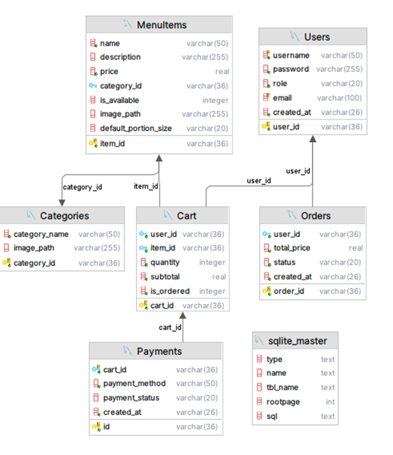
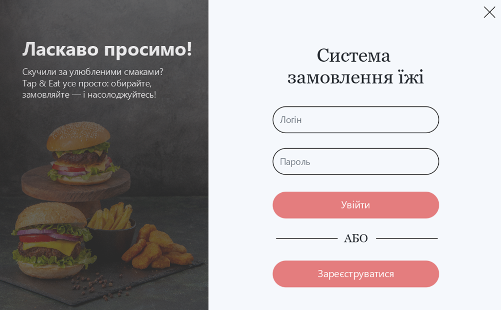
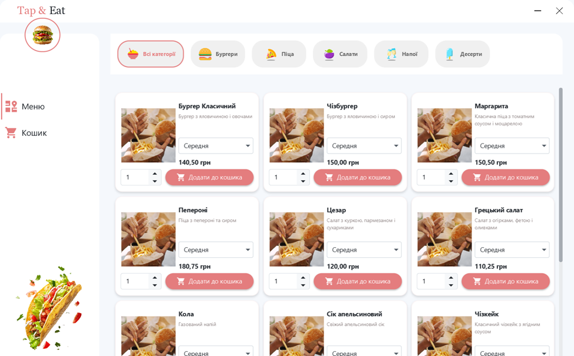
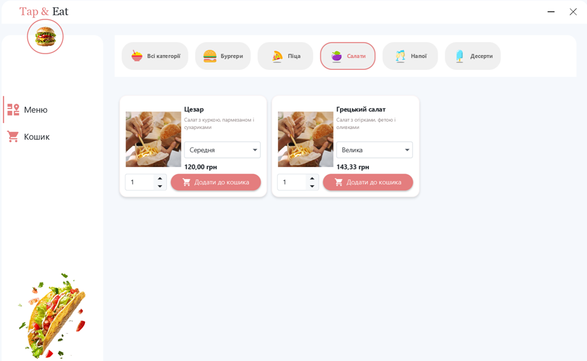
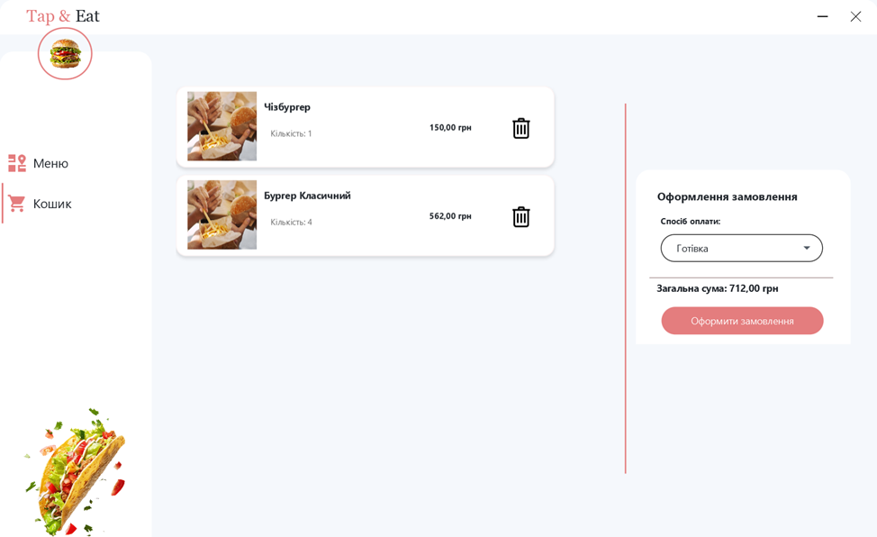
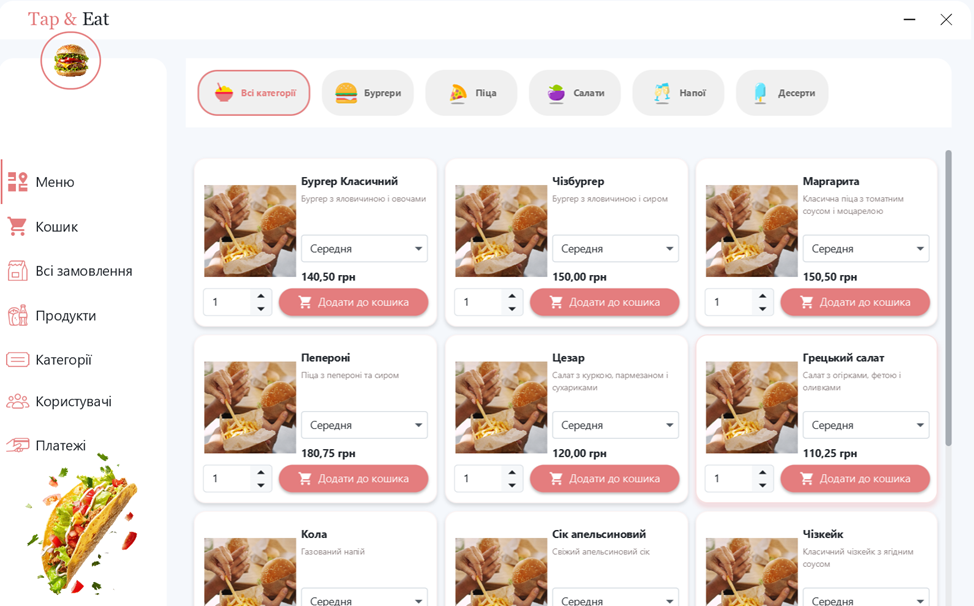

# Fast Food Kiosk System

A comprehensive self-service kiosk application designed for fast food establishments, built with JavaFX and SQLite. This system provides an intuitive interface for customers to browse menus, customize orders, and complete purchases, while offering powerful administrative tools for restaurant management.

## 🚀 Features

### Customer Interface
- **Interactive Menu Browsing**: category-based navigation with visual food cards
- **Portion Size Selection**: flexible sizing options (Small, Medium, Large, Extra Large) with dynamic pricing
- **Shopping Cart Management**: add, modify, and remove items with real-time total calculation
- **Multiple Payment Methods**: support for cash and card payments
- **User Authentication**: secure login system with role-based access

### Administrative Interface
- **Menu Management**: create, edit, and organize food items with categories
- **Order Tracking**: monitor order status from pending to delivery
- **User Management**: manage customer accounts and staff permissions
- **Payment Processing**: track and manage payment transactions
- **Category Organization**: organize menu items with custom categories and images

### Technical Features
- **Offline Operation**: fully functional without internet connectivity
- **Responsive UI**: touch-friendly interface optimized for kiosk displays
- **Data Validation**: comprehensive input validation and error handling
- **Image Management**: support for food and category images with caching
- **Asynchronous Processing**: non-blocking UI with progress indicators

## 🛠️ Technology Stack

- **Frontend**: JavaFX 22 with FXML
- **Backend**: Java 24 with preview features
- **Database**: SQLite with HikariCP connection pooling
- **UI Theme**: AtlantaFX for modern styling
- **Build Tool**: Maven
- **Logging**: SLF4J with Log4j
- **Architecture**: Three-layer architecture (Presentation, Domain, Persistence)

## 📋 Prerequisites

- Java 24 
- Maven 3.6+
- Windows/Linux/macOS (any JVM-compatible platform)

## 🔧 Installation & Setup

1. **Clone the repository**
   ```bash
   git clone https://github.com/yourusername/fastfoodkiosk.git
   cd fastfoodkiosk
   ```

2. **Build the project**
   ```bash
   mvn clean compile
   ```

3. **Initialize the database**
   The SQLite database will be automatically created on first run using the DDL and DML scripts.

4. **Run the application**
   ```bash
   mvn javafx:run
   ```

   Or run a .jar or .exe file in the project root.

## 🗄️ Database Schema

The system uses a normalized SQLite database with the following tables:

- **Users**: Customer and admin account management
- **Categories**: Food category organization
- **MenuItems**: Food items with pricing and portion information
- **Orders**: Order tracking and status management
- **Cart**: Shopping cart items for active sessions
- **Payments**: Payment transaction records



*Figure 1: Database Entity Relationship Diagram*

## 🏗️ Architecture

The application follows a three-layer architecture pattern:

### Presentation Layer
- JavaFX controllers and FXML views
- User input validation
- UI event handling

### Domain Layer
- Business logic and rules
- Security components
- Custom exceptions

### Persistence Layer
- Repository pattern implementation
- Database connection management
- Entity definitions

## 🎨 User Interface

### Login Screen
The application starts with a secure authentication screen supporting both customer and administrator access.



*Figure 2: Login Interface*

### Main Menu Navigation
Role-based navigation with different options for customers and administrators.



*Figure 3: Main Menu Interface*

### Menu Browsing
Interactive menu display with category filtering and portion size selection.


*Figure 4: Menu Browsing Interface*

### Shopping Cart
Real-time cart management with dynamic pricing calculations.


*Figure 5: Shopping Cart Interface*

### Administrative Panel
Comprehensive management tools for menu, orders, and user administration.


*Figure 6: Admin Panel Interface*

## 🔐 Security Features

- **Password Hashing**: SHA-256 encryption for user passwords
- **Role-Based Access**: separate permissions for customers and administrators
- **Input Validation**: comprehensive data validation at all levels

## 🔄 Order Workflow

1. **Browse Menu**: customer selects items by category
2. **Customize Order**: choose portion sizes and quantities
3. **Add to Cart**: stems added with calculated pricing
4. **Review Cart**: modify quantities or remove items
5. **Select Payment**: choose cash or card payment
6. **Place Order**: order created with pending status
7. **Order Processing**: admin updates status through workflow
8. **Completion**: order marked as delivered

## 🛡️ Design Patterns Used

- **Singleton**: database connection management
- **Repository**: data access abstraction
- **MVC**: separation of concerns
- **Observer**: UI reactive updates
- **Command**: event handling
- **Record**: immutable data transfer objects
- **Strategy**: payment method handling

## 📁 Project Structure

```
src/
├── main/
│   ├── java/com/metenkanich/fastfoodkiosk/
│   │   ├── domain/              # Business logic layer
│   │   │   ├── exception/       # Custom exceptions
│   │   │   └── security/        # Security components
│   │   ├── persistence/         # Data access layer
│   │   │   ├── connection/      # Database connections
│   │   │   ├── entity/          # Data entities
│   │   │   └── repository/      # Data repositories
│   │   └── presentation/        # UI layer
│   │       ├── controller/      # JavaFX controllers
│   │       └── validation/      # Input validation
│   └── resources/
│       ├── view/               # FXML files
│       ├── images/             # UI images
│       ├── design/             # CSS styles
│       ├── ddl.sql            # Database schema
│       └── dml.sql            # Sample data
```

## 🚀 Deployment

### Standalone Deployment
The application is designed for local deployment on kiosk terminals:

1. Package as executable JAR
2. Include SQLite database file
3. Configure for touch screen interface
4. Set up automatic startup

### System Requirements
- **RAM**: 512MB minimum, 1GB recommended
- **Storage**: 100MB for application + database
- **Display**: 1024x768 minimum resolution
- **Input**: touch screen or mouse/keyboard

### UI Configuration
- Touch-friendly button sizes
- High contrast colors for visibility
- Responsive layout for different screen sizes

## 🤝 Contributing

1. Fork the repository
2. Create a feature branch (`git checkout -b feature/AmazingFeature`)
3. Commit your changes (`git commit -m 'Add some AmazingFeature'`)
4. Push to the branch (`git push origin feature/AmazingFeature`)
5. Open a Pull Request

## 📝 License

This project is licensed under the MIT License - see the [LICENSE](LICENSE) file for details.

## 👥 Authors

- **Oleksandra**  - [Sashka11111](https://github.com/Sashka11111)

## 🙏 Acknowledgments

- JavaFX community for excellent documentation
- AtlantaFX for modern UI theming
- SQLite team for reliable database engine
- HikariCP for high-performance connection pooling

## 📞 Support

For support and questions:
- Create an issue on GitHub
- Email: schmidtcorporation.dev@gmail.com

---

*Built with ❤️ for the fast food industry*
